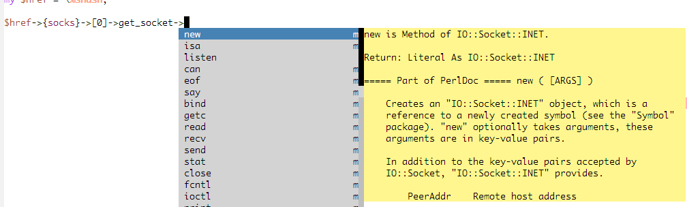
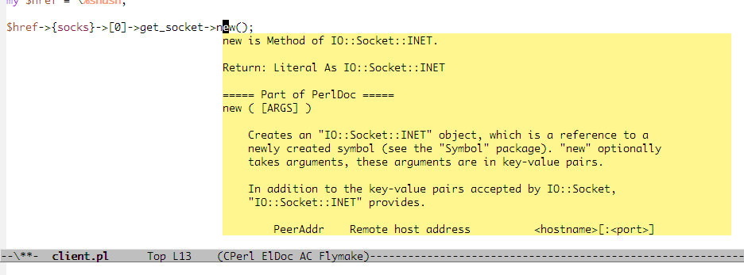
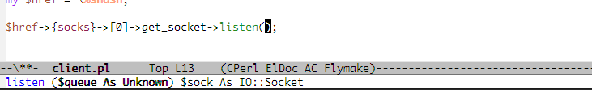

[](https://travis-ci.org/aki2o/plsense)

# これは何？

ソースコード解析による型推論を用いて、Perl開発をサポートするツールです。  
EmacsやVimなどの高機能エディタから利用されることを前提に設計しています。  

# 特徴

本ツールを利用することで、以下が実現可能です。

### オムニ補完

以下のプログラミング要素について、コンテキストに合わせた補完、いわゆるオムニ補完ができます。  
-   変数
-   インスタンスメソッド
-   クラスのイニシャライザ
-   use/requireモジュール
-   use/requireするモジュールに渡すLIST要素
-   ハッシュキー



### 適切なヘルプ



### メソッドシグネチャ



### 定義元ジャンプ

# デモ

本ツールをEmacsで利用した場合に可能になる、コーディングのデモです。  

<http://www.youtube.com/watch?v=Q8XDhxqmaXs>

Emacsでの利用に関して、詳しくは以下を参照して下さい。  

<https://github.com/aki2o/emacs-plsense/blob/master/README-ja.md>

# インストール

本ツールはPerlモジュールです。  

### CPANからインストール

2013/07/24  CPANにアップロードするための申請中ですが、一向に申請が通る気配がありません。

### cpanmでインストール

 から最新のPlSense-\*.tar.gzをダウンロードして、cpanmコマンドに、そのファイルパスを渡して下さい。  

### 手動でインストール

 から最新のPlSense-\*.tar.gzをダウンロードして解凍、できたディレクトリに移動後、以下を実行して下さい。  

```
$ perl Makefile.PL
$ make
$ make test
$ make install
```

手動の場合、依存モジュールがインストールされていないとエラーになると思います。  
都度、インストールして頂くか、Makefile.PLを参照して下さい。

### インストール確認

本ツールのインストールにより、plsenseコマンドが提供されます。  
ターミナルから\`plsense -v\`を実行してみて下さい。  
本ツールのバージョン情報が表示されるはずです。

### インストール後やること

本ツールを利用するには設定ファイルを用意するのが簡単です。  
ターミナルから\`plsense\`と実行して下さい。設定ファイルを作成するか聞かれるので、作成して下さい。  
-   再作成するには\`plsense config\`と実行して下さい。
-   設定ファイルを作らず利用することも可能です。 <https://github.com/aki2o/plsense/wiki/Config-@ja> を参照して下さい。

# 使い方

エンドユーザの方は、本ツールの使い方は意識する必要はないのではと思います。  
本ツールの仕様や使い方などを知りたい場合は、 <https://github.com/aki2o/plsense/wiki/Home-@ja> を参照して下さい。  

# 動作確認

-   WindowsXP Pro SP3 32bit
-   Cygwin 1.7.20-1
-   Perl 5.14.2

**Enjoy!!!**
