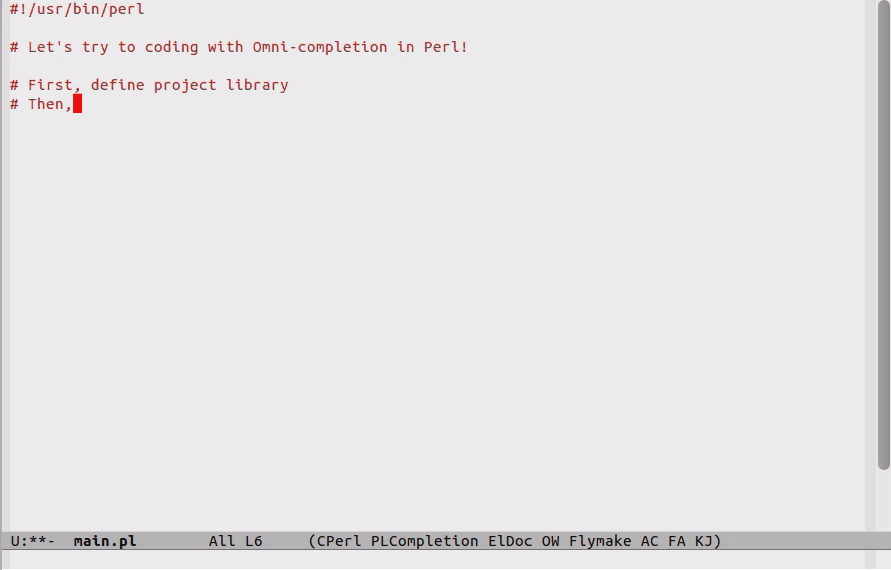

[](https://travis-ci.org/aki2o/plsense)

[Japanese](https://github.com/aki2o/plsense/blob/master/README-ja.md)

# What's this?

This is a development tool for Perl using the type inference by analyzing source code.  
This tool is for highly functional editor like Emacs/Vim.

# Feature

You can do the following function by using this tool.

### Omni Completion

About the following programming element, you can do the optimized completion for context.  
It's Omni completion what is called.  
-   Variable
-   Method
-   Module
-   Initializer of Class
-   LIST of Use/Require statement
-   Key of Hash


### Smart Help


### Sub Signature


### Jump To Definition

# Demo

This is a coding demo when this tool is used on Emacs.



Here is a long version -> <https://www.youtube.com/watch?v=qurNSQjOyK4>

For using on Emacs, see <https://github.com/aki2o/emacs-plsense/blob/master/README.md>

# Install

This tool is a Perl module.

### From CPAN

2013/07/24 Not yet available.

### Using cpanm

Download latest PlSense-\*.tar.gz from [here](https://github.com/aki2o/plsense/releases) and
execute cpanm to the downloaded file path.

### Manually

Download latest PlSense-\*.tar.gz from [here](https://github.com/aki2o/plsense/releases) and
extract the file, move the maked directory, execute the following.

```
$ perl Makefile.PL
$ make
$ make test
$ make install
```

If the module is not yet installed that this module depends on, error maybe happen.  
In the case, install the module and retry. About the module, see Makefile.PL.

### Verify Installation

execute `plsense -v` on shell.  
If show the PlSense version, installation is finished.

### After Installation

Making config file is easy way for using this tool.  
Do `plsense` on terminal. plsense confirm whether make config file.  
-   For remake config file, do `plsense config`.
-   You can use this tool without config file. see <https://github.com/aki2o/plsense/wiki/Config>.

# Usage

Perhaps end user don't need to know the usage of this tool.  
About the usage/specification of this tool, see <https://github.com/aki2o/plsense/wiki/Home>.  

# Tested On

-   WindowsXP Pro SP3 32bit
-   Cygwin 1.7.20-1
-   Perl 5.14.2

**Enjoy!!!**
